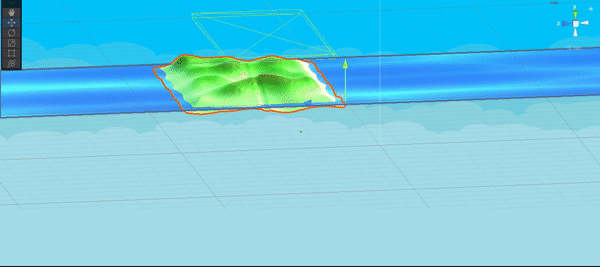
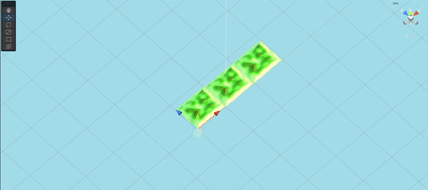
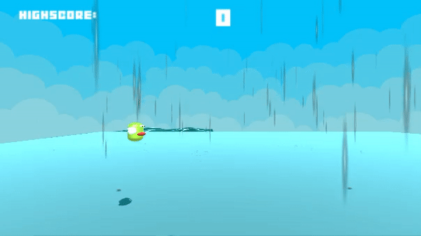

**The University of Melbourne**
# COMP30019 – Graphics and Interaction

## Notice
Please open the game in Full HD (1920 x 1080) for the best experience.
## Teamwork plan/summary

<!-- [[StartTeamworkPlan]] PLEASE LEAVE THIS LINE UNTOUCHED -->

<!-- Fill this section by Milestone 1 (see specification for details) -->

There are 3 members in our group. All members are responsible for finding the documentation for useful tools and techniques. A shared note will be used to ensure concurrency.
Each member is assigned to the following tasks: 
- Truong Giang Hoang: 
  - Shading. 
  - Video editing
  - Report writing
  - Carrying out part of the querying
  - Testing game's playability
  - Code review
- Tran Dao Le: 
  - Shading. 
  - Carrying out part of querying
  - Report writing
  - Code review
- Tuan Phong Vu: 
  - Setting up basic logic and UI for the game
  - Report Writing
  - Carrying out part of the querying
  - Code review

<!-- [[EndTeamworkPlan]] PLEASE LEAVE THIS LINE UNTOUCHED -->

## Final report
### Table of contents
- [COMP30019 – Graphics and Interaction](#comp30019--graphics-and-interaction)
  - [Notice](#notice)
  - [Teamwork plan/summary](#teamwork-plansummary)
  - [Final report](#final-report)
    - [Table of contents](#table-of-contents)
    - [Game Summary](#game-summary)
    - [Tutorial](#tutorial)
    - [High Level Design Decisions](#high-level-design-decisions)
      - [Reasoning behind chosen controls](#reasoning-behind-chosen-controls)
      - [Dealing with character occlusion](#dealing-with-character-occlusion)
      - [Graphical style](#graphical-style)
      - [Procedural Generation](#procedural-generation)
      - [Shaders](#shaders)
      - [Particles](#particles)
    - [Technologies](#technologies)
    - [Demonstrative Images](#demonstrative-images)
    - [Code Snippets](#code-snippets)
    - [Querying and observational method](#querying-and-observational-method)
      - [Querying method](#querying-method)
      - [Observational method](#observational-method)
    - [Users' feedback](#users-feedback)
      - [Content of questionnaire](#content-of-questionnaire)
      - [Users' demographic](#users-demographic)
      - [Questionnaire result](#questionnaire-result)
      - [Positively-regarded aspects of the game](#positively-regarded-aspects-of-the-game)
      - [Most requested aspects for improvement](#most-requested-aspects-for-improvement)
      - [Applying users' feedback to the game](#applying-users-feedback-to-the-game)
      - [Requested aspects that are not in the game](#requested-aspects-that-are-not-in-the-game)
    - [Reference](#reference)
  

### Game Summary 
Taking inspiration from the original game Flappy Bird, Flap Birdy is a first-person and third-person arcade game. Main objective of the game is to slot through the gaps between obstacle pipes to survive. If the bird hits a pipe, flies to the ground or flies up too high, the bird dies and the round ends. 

Players can perform certain tasks that give the bird powers, such as shooting down trees to activate pipe-destroying eggs. This game can be played in both first or third-person, depending on player's preference: players can switch point-of-view before the game starts or while playing.

### Tutorial
Since we're not deploying Flap Birdy on smartphones, the controls are different compared to the original Flappy Bird. Players press "Space" for the bird to fly up. They can press "C" to change between first and third-person view. We recommend playing around with this feature since it really helps deal with situation where obstacles block players' view from either perspective. (i.e a tree blocking the bird when in third-person). In first-person view, they can also toggle their mouse to look around the map. 

In first-person mode, players have the option to shoot obstacles down. When possible, players press "A" to activate guns by the bird's wings. Player then left-click their mouse to shoot eggs from the side of the bird, and toggle their mouse to shoot bullets in the desired direction. There is a certain firing rate in place to make the game more balanced.

There are limited types of obstacles that players can destroy. Players should only destroy trees WITH LEAVES, or "special" trees. If players correctly hit a "special" tree, it will lean (at the angle of contact), and another shot is required to destroy that tree. Upon being destroyed, the tree will give the bird a power recharge that allows it to shoot eggs at pipes and destroy them if players wish to do so. This power recharge expires after 3 seconds.

### High Level Design Decisions

#### Reasoning behind chosen controls
Players are expected to use their right hand for the mouse control, and their left hand for other controls. To be specific, they are expected to use their thumb to make the bird fly up, their index to change point of view, and their pinky to activate the gun. <br \>
Therefore, we make "Space" the key to make the bird go up as it is the easiest key to navigate and press on the keyboard. We assign the key "C", which stands for "Change", to changing point of view. Finally, we assign the key "A", which stands for "Activation", to activating the gun wing.

#### Dealing with character occlusion
With the option to switch point-of-view, players can choose to switch to first-person camera if the bird is blocked by terrain or trees. When the bird is no longer blocked, players can keep playing in first-person view if they want a challenge, or switch back to third-person camera if they want.

#### Graphical style
We want our bird to live in its natural habitat, which is why we design our map to resemble a forest (trees, rivers etc.). We also feel like a forest is a random environment, meaning terrains are formed in an unpredictable manner, and that trees grow at unpredictable places. This helps with our procedural generation.

#### Procedural Generation

The whole environment, apart from the water, is produced using the script `./Assets/Scripts/Environment.cs` while `./Assets/Scripts/Tilemanagement.cs` is used to extend it to make the environment "infinte". 
- We generate each mesh according to our customizable x-value and z-value plane, which will give us a flat plane. To create the "Environment", PerlinNoise are used to create mountains and the up-and-down effect of the terrain. Small multiplication offsets are used to smooth out the terrain and avoid unnecessarily spiky or unrealistic environment. 
- Trees are located at random but not too low (to avoid water) and not to steep on the slope. Most importantly, trees are not allowed to spawn in the middle area where pipe will be spawned.
- There is a small "dent" in the middle of the environment, indicating the positions of pipes that will be generated.
- Pipes are generated based on the terrain height, as well as small random height offsets. Pipes located too low (e.g at the end of a slope) will receive a height boost according to this formula: (highest pipe - pipe we want to raise)/ 1.6f. This allows players to have a enjoyable experience as pipes are not located in unplayable positions.
- Fall off map is also implemented for the land to resemble an island and for water elements and their shaders to have more room to showcase their effects. This also prevents players from being able to see the inside of our terrain when they cross between 2 environments.
- Explanation for how we implement our procedural generation is included in the comments of the code snippet.
#### Shaders
We use 2 shaders, one vertex shader and one pixel shader
1. Water shader: Can be found under `./Assets/Shader/water.shader`
- This is a vertex shader, taking inspiration from Workshop 7.
- At its core, we modify the sine functions to change how the displacement of vertices work to suit our game design
- For "vertOut", we design it so that "uv" also factors in an element of time, to create a wavy effect on the water texture. Details on how the function works will be included in the code snippets.
- Rationale behind the use of shader: We want to implement it in a way so that the movements of water are more realistic than what Workshop 7's code does.
- Shadow Receiving and Casting is also applied to create shadow of objects on the water surface, as well as casting shadows on other objects.

2. Fog shader: Can be found under `./Assets/Shader/FogImageEffectShader.shader`
- This is a pixel shader.
- This is a post-processing shader, applied to both first-person and third-person cameras.
- This shader determines the depth of a pixel compared to current camera position and applies a foggy effect on that pixel. The farther a pixel is, the heavier the fog and vice versa.
- A function is custom-designed to determine how heavy the fog is. It is a combination of a linear and a logarithm function. Details on how the function works will be included in the code snippets.
- Rationale behind the use of shader: We want to limit players' view so that players do not see the entire map. We also want to add mysteriousness to the game and make it aesthetically pleasing.
#### Particles
- The particle system to be marked: Rain (Under: `./Assets/Prefab/Rain.prefab`).
- This particle system randomizes the y-axis under "velocity over time" and in 3D start-size to create variations in droplets.
- "Color" and "Color over Lifetime" are also used to make the particles not so vivid-looking, especially at the start and end of the life duration (fade effect), further enhancing the realness of the rain. 
- Collision is also included but without the bounce factor. This accompany that with Sub Emitters that called whenever the particles collide with any of our world object. Sub Emitters allows us to create a child particle and this time what we looking for is a splash effect whenever the rain particles collision is detected. This child particles will not have an excessively long life duration but have enough emission and speed to create that splash effect.
- Stretch billboard under Renderer the real factor that make the particles "rain-like".
- GIFs about this particle are included under GIF section.
- Note: The game logic will activate rain only when players get passed 10 points.
### Technologies
Project is created with:
* Unity 2022.1.9f1 
* Ipsum version: 2.33
* Ament library version: 999

### Demonstrative Images

<p align="center">
  
  
  
</p>

These are descriptive picture for FallOffMap, TileManagement and Particles respectively.

### Code Snippets 
- Procedural generation: Explanation for these code snippets are in the comments of the code itself
```c#
      // Generate Plain terrain
      vertices = new Vector3[(SizeX +1 ) * (SizeZ + 1)];
        // creating a FallOffMap noise map
        float [,] noiseMap = FallOffMap(startFall,1f);
        int i = 0;
        for (int z = 0; z <= SizeZ ; z++){
            for( int x = 0; x <=SizeX; x++ )
            {
                float xOffSet = Random.Range (0f,0.04f);
                float yOffSet = Random.Range (0f,0.04f);
                // utilize perlinnoise to generate variety terrain height
                // 0.05 are use to smooth out the noise, make them less spiky
                // everything is then multiply with noiseMap for implementation fall off map 
                float height = Mathf.PerlinNoise(x  * 0.05f+ xOffSet ,z * 0.05f +yOffSet ) * depth * noiseMap[x,z];
                // dent in the middlee 
                if (System.Math.Abs(z - 200) < 2) height -= 0.5f;

                // that vertices here will now have all the info to draw the mesh.
                vertices[i] = new Vector3(x,height,z);
                i++;
            }
        }
```
```c#
  // The fall off map code
  private float[,] FallOffMap(float falloffStart, float falloffEnd)
      {
          float [,] mapHeight = new float[SizeX+1,SizeZ+1];

          for(int y = 0; y <= SizeZ; y++)
          {
              for(int x = 0; x <= SizeX; x++)
              {
                 // from x,y coordinate generate them into pos with coordinate ranging from -1 to 1 
                  Vector2 pos = new Vector2((float)x / SizeX * 2 -1,(float)y/SizeZ * 2 -1);
                  //  find closest value to the edge
                  float t = Mathf.Max(Mathf.Abs(pos.x),Mathf.Abs(pos.y));

                  // regular height if in range
                  if (t < falloffStart) mapHeight[x , y ] = 1;
                  // no height if out of range
                  else if (t > falloffEnd) mapHeight[x,y] = 0;
                  // if in between range, smooth transition
                  else mapHeight[x,y] = Mathf.SmoothStep(1,0,Mathf.InverseLerp(falloffStart,falloffEnd,t));
              }
          }
          return mapHeight;
      }
```
- Water shader:
```c#
  Properties
    {
      _MainTex ("Texture", 2D) = "white" {}
      _Wave1Amp ("Wave 1 Amp", Float) = 0.3
      _Wave1Xfreq ("Wave 1 X Frequency", Float) = 1.256
      _Wave1Zfreq ("Wave 1 Z Frequency", Float) = 1
      _Wave1XComp ("Wave 1 X Component", Float) = 0.3

      _Wave2Amp ("Wave 2 Amp", Float) = 0.2
      _Wave2Xfreq ("Wave 2 X Frequency", Float) = 1.256
      _Wave2Zfreq ("Wave 2 Z Frequency", Float) = 1.5

      _TimeFreq ("Time Freq", Float) = 1
      _ShawdowBlendValue ("Shadow Blend Value", Range(0,1)) = 0.3
    }
  vertOut vert(vertIn v)
    {
      // Displace the original vertex in model space
      float wave1Y = _Wave1Amp*(_Wave1XComp*sin(_Wave1Xfreq*v.vertex.x + _TimeFreq*_Time.y)+(1.0f - _Wave1XComp)*sin(_Wave1Zfreq*v.vertex.z + _TimeFreq*_Time.y));
      float wave2Y = _Wave2Amp*(sin(_Wave2Xfreq*v.vertex.x + _Wave2Zfreq*v.vertex.z + _TimeFreq*_Time.y));
      float4 displacement = float4(0.0f, wave1Y + wave2Y, 0.0f, 0.0f);
      v.vertex += displacement;

      vertOut o;
      o.vertex = UnityObjectToClipPos(v.vertex);
      o.uv = v.uv;
      o.uv += 0.01*_Time.y;

      o.pos = o.vertex;
			TRANSFER_VERTEX_TO_FRAGMENT(o)
      return o;
    }
```
  - Explanation: 
    - This modified sine functions aim to smooth out the effects of the wave. This is because the waves created with Workshop 7's code is very ragged. They resemble the oscillation of planes more than they replicate the effects of real water with real waves.
    - o.uv also factors in Time.y to create a wavy effect for our water texture
    - We also implement Shadow for the water to increase realness. Shadow Casting is implemented with the help of "Legacy Shaders/VertexLit/SHADOWCASTER", while Shadow Receiving is implemented in the Shader Pass.
    - The shader is put into use via the following function:
```c#
  fixed4 frag(vertOut v) : SV_Target
    {
      fixed4 col = tex2D(_MainTex, v.uv);
      float shadowIntensity = 1 - SHADOW_ATTENUATION(v);
      float textureIntensity = 1 - _ShawdowBlendValue*shadowIntensity;
      return textureIntensity*col;
    }
```

- Fog effect shader:
```c#
  Properties
    {
      _MainTex ("Texture", 2D) = "white" {}
      _FogColor("Fog Color", Color) = (1,1,1,1)
      _FogDensity("Fog Density", Range(0, 1)) = 0.8
      _LinearFogBreak ("Linear Fog Break", Range(0, 0.5)) = 0.015
      _FogLogXParameter ("Fog Log Parameter", Float) = 100
    }

  float combinationFunction (float x) {
    if (x < _LinearFogBreak) {
      return x;
    } else {
      return x + log10(1.0f + (x-_LinearFogBreak)*_FogLogXParameter);
    }
  }

  float greaterThanZeroTanh (float x) {
    float tanhX = tanh(x);
    if (x > 0.0f) {
      return tanhX;
    } else {
      return 0;
    }
  }
```
  - Explanation: 
    - How heavy the fog is is determined by our combinationFunction, taking the distance from pixel to camera as an argument. If the distance is relatively small, the fog effect increases linearly, indicated by the linear part of the function. As the distance surpasses a threshold (_LinearFogBreak, which is adjustable in Unity), we decide to let the fog effect increase logarithmically. This is to prevent the fog from getting too heavy and blocking players' vision, while also enhancing realness of the fog.
    - combinationFunction is adjustable. To be specific, _LinearFogBreak, _FogLogXParameter and _FogDensity are adjustable, giving flexibility to the game.
    - We then need to map the result from combinationFunction to a number between 0 and 1, as we will make use of the "lerp" function in the code snippet below to create the final render.
    - The shader is put into use via the following function:
```c#
  fixed4 frag (v2f i) : SV_Target
  {
    fixed4 col = tex2D(_MainTex, i.uv);
    float depth = UNITY_SAMPLE_DEPTH(tex2D(_CameraDepthTexture, i.uv));
    float linearDepth = Linear01Depth(depth);
    float logarithDepth = combinationFunction(linearDepth);
    float fogIntensity = greaterThanZeroTanh(logarithDepth * _FogDensity);
    return lerp(col, _FogColor, fogIntensity);
  }
```
  
### Querying and observational method

#### Querying method
Our querying method is questionnaire: we give a fixed set of questions to participants. We design the questionnaire so that it is direct: all questions are either multiple-choice or scalar. Since our game is not too complex, we only need to focus on a small set of problems.

One advantage of questionnaires is that they are time-efficient. They do not take long for moderators to make and for users to answer. Another advantage is that data collected by questionnaires are quantifiable, meaning we can obtain demographics of, and different percentages from participants, therefore helping us identify the problems more quickly.

#### Observational method
Our observational method is cooperative evaluation. In cooperative evaluation, participants give us real-time feedback of the game while they also can ask the moderators questions. 

We choose this observational method as we run into problems when exporting the game. To be precise, participants must play the game on our local devices. If we were to go with post-task walkthroughs, the process of recording and replaying the gameplay is challenging. Therefore, since we have to watch participants play regardless, we allow them to ask us questions in order to gain more insight to the game.

One advantage of cooperative evaluation is the interaction between users and moderators. This interaction eliminates awkwardness and provides users with a less stressful time playing the game, since the moderators would know best what to do in what situation in the game. Being less stressed when playing the game allows users to go deeper and experiment with many game elements, providing a lot of useful information. Also, cooperative evaluation minimizes the trade-off between time spent observing and insight to the game. This is because in terms of logic and control, our game is straightforward, and the main focus is graphical elements.

### Users' feedback

#### Content of questionnaire
We ask our participants a total of 13 questions, in the following order:
1. Age: whether they're under 18, between 18 to 25, between 25 to 30, or above 30.
2. Sex: whether they're male, female or they prefer not to say.
3. Daily time spent playing video games: whether it's none, less than 1 hour, from 1 to 2 hours or more than 2 hours.
4. If they feel this is a fun new implementation of the original Flappy Bird game (yes/no)
5. If the game is easy for them to play (yes/no)
6. If the objective of the game is clear to them (yes/no)
7. If the game is more fun/challenging in first-person view (yes/no)
8. If the camera control to change between third and first-person is a nice addition (yes/no)
9. How the egg-shooting feature makes the game more challenging: scalar 1-10, 1 being not challenging, 10 being very challenging.
10. How the speed of the eggs being shot should change: Increase, decrease or no change
11. How pleasant the graphics is: scalar 1-10, 1 being not pleasant, 10 being very pleasant.
12. What can be improved graphics-wise: a choice among color saturation, bird/obstacle design, effects of the egg-shooting feature, map design/layout, and an "Other" option for participants to freely add what they find inadequate.
13. How they would rate the game overall: scalar 1-10.

We will now refer to these questions as Q1 to Q13 in the remaining sections of the report.
#### Users' demographic
There are 11 participants in our experiment. Here are the basic demographic of the participants:
- Age: 90.9% are between 18-25 years of age, 9.1% are under 18 years of age.
- Sex: 54.5% are males, 45.5% are females.
- Daily time spent playing video games: 18.2% virtually play no games, 45.5% play for less than 1 hour, 9.1% for 1-2 hours and 27.3% for more than 2 hours.

Since our game targets the younger population, we decide that all participants are students, and should be around 18 to 25 years of age. We also want to design our game so that people of any proficiency in gaming, which is why the proportions of male and female participants are roughly the same.

#### Questionnaire result
Apart from the users' demographic which corresponds to Q1, Q2 and Q3, we obtain the following findings:
- Q4: 10/11 (90.9%) say Yes, 1/11 say No (9.1%).
- Q5: 7/11 (63.6%) say Yes, 4/11 say No (36.4%).
- Q6: 10/11 (90.9%) say Yes, 1/11 say No (9.1%).
- Q7: 10/11 (90.9%) say Yes, 1/11 say No (9.1%).
- Q8: 10/11 (90.9%) say Yes, 1/11 say No (9.1%).
- Q9: 9.1% say 1, 9.1% say 3, 9.1% say 5, 9.1% say 6, 18.2% say 7, 27.3% say 8, 18.2% say 10.
- Q10: 45.5% say No Change, 54.5% say Increase.
- Q11: 9.1% say 6, 27.3% say 7, 27.3% say 8, 18.2% say 9, 18.2% say 10.
- Q12: 18.2% say Color Saturation, 63.6% say Obstacle/Bird Design, 27.3% say Egg Shooting Feature, 36.4% say Map Design. There are other ideas such as Halloween theme or the addition of crosshair.
- Q13: 9.1% say 3, 9.1% say 7, 36.4% say 8, 18.2% say 9, 27.3% say 10.
#### Positively-regarded aspects of the game
- Option to change point-of-view: 10/11 participants (90.9%) review that the option to change camera view makes the game more challenging and immersive.

#### Most requested aspects for improvement
- Bullet speed: The bullet was originally too slow when applying gravity. Upon testing, we realized that we should increase the bullet speed. Data collected from the questionnaire suggest more than half of the participants (54.5%) requested a further increase in bullet speed.
- Difficulty of egg-shooting feature: Due to the fast firing rate, only 2/11 participants (18.2%) report that it makes the game very difficult. However, our intention is to make the game more difficult and distracting when adding the egg shooting feature.
- Map layout/design: This graphical element of the game is one of the most requested for improvement, with 4/11 participants (36.4%) mentioning it in the questionnaire

#### Applying users' feedback to the game
- Bullet speed: We increase the bullet speed eightfold to partially negate the effect of gravity. This results in a straighter initial trajectory of the bullets, suitable for aiming at obstacles close by.
- Egg-shooting feature: We decide to reduce the firing rate so that users are encouraged to shoot more carefully.
- Map layout/design: We've made a lot of changes to the map compared to what we had in the video demo.
  - We've added rain and shaky pipes after players get passed 10 points. 
  - We've also made the sky darker to bring a stormy and jarring atmosphere to the game, with the hope of making the game harder by unsettling players.
  - We've fine-tuned our shaders to generate fog to go with the rain to decrease visibility and give the game some realness.
  - We've fine-tuned our shaders to give water a more realistic wavy effect.

#### Requested aspects that are not in the game
- Halloween theme: we did not design the game with this in mind. Also, this addition would take a lot of unnecessary effort. Therefore, we decide that we will showcase what we have learned and apply it to just one map design.
- Crosshair for aiming: this is an interesting feedback from some of the male participants. We acknowledge that a crosshair would make shooting much more enjoyable, but since the sizes of the eggs and obstacles are already large, we decide that players could still easily destroy obstacles.

### Reference
- While the leaning and destroying tree is our own code in BulletCollision.cs, the tree design itself is credited to package "Cartoon low poly tree" by creator "create smth" which is available on Unity asset store. Luckily these assets also come with a perfect material to be implemented for the pipe.

  https://assetstore.unity.com/packages/3d/props/exterior/cartoon-low-poly-tree-211305

- 2 skybox designs are from Unity asset store under the name "Farland Skies - Cloudy Crown" by Borodar:
  
  https://assetstore.unity.com/packages/2d/textures-materials/sky/farland-skies-cloudy-crown-60004

- Background music from "Jexter" and "Minetrackmania" from Youtube:

  https://www.youtube.com/watch?v=WxI_bK3huqI&ab_channel=Jextor
  https://www.youtube.com/watch?v=vLVRmC-q9Oc&ab_channel=Minetrackmania

- All SFX can be found on Pixabay by searching keyword.

- flappy-font.ttf are available at: https://www.dafont.com/flappybirdy.font

- Water shader: https://github.com/COMP30019/Workshop-7-Solution
- Water shadow: https://docs.unity3d.com/560/Documentation/Manual/SL-VertexFragmentShaderExamples.htmlfbclid=IwAR0bhZEv0MLYcfTKSWwohNTZAjHPG9yUGMfCoWpP1_Ir5eiIAQd62vtQL1A
- Fog effect shader: https://www.youtube.com/watch?v=XD2ryuF6leA

- A sincere appreciation towards creators who made free instructions and tutorials online since this project will not be able to be completed without their help, such as "Brackeys", "Sebastian Lague" and many more.
